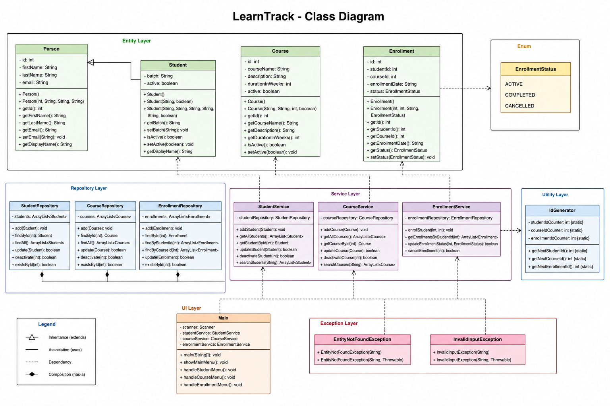

**Design Notes**
Class Diagram : 

**Why ArrayList Instead of Array?**
    The project uses ArrayList because it provides dynamic memory allocation. 
    Unlike arrays, an ArrayList automatically increases its size whenever new elements are added.

**Advantages of ArrayList:**
    Dynamic size
    Easy insertion and deletion
    Built-in utility methods
    Suitable for storing objects like Students, Courses, and Enrollments
    Since this project stores data only in memory, ArrayList is a better choice than a fixed-size array.

**Where Static Members Are Used**
    Static members are used in the IdGenerator utility class.
    Example:
        studentIdCounter
        courseIdCounter
        enrollmentIdCounter

**Static methods:**
    getNextStudentId()
    getNextCourseId()
    getNextEnrollmentId()
    Using static members ensures that IDs are generated globally without creating multiple IdGenerator objects.

**Where Inheritance Is Used**
    The project uses inheritance through the Person class.
         Person
            ↑
         Student
    The Person class contains common fields:
        id
        firstName
        lastName
        email
    The Student class extends Person and adds:
        batch
        active

Using inheritance avoids duplicate code and improves code reusability.

**Encapsulation**
    All entity classes use private data members and public getter/setter methods.
    **Classes:**
        Student
        Course
        Enrollment
    This protects object data and follows Object-Oriented Programming principles.

**Exception Handling**
    A custom exception named EntityNotFoundException is implemented.
    It is used whenever:
        Student ID is not found
        Course ID is not found
        Enrollment ID is not found

The application catches the exception and displays a user-friendly message instead of terminating the program.

**Project Architecture**

The project follows a layered architecture.
    Main (Console UI)
        │
        ▼
    Service Layer
        │
        ▼
    Repository Layer
        │
        ▼
    ArrayList (In-Memory Storage)
    
**Responsibilities**
    **Main.java**
        Displays menu
        Reads user input
        Calls service methods
    **Service Layer**
        Business logic
        Validation
        Exception handling
    **Repository Layer**
        Stores data in ArrayList
        Performs CRUD operations
    **Entity Classes**
        Represent application data

**Clean Code Practices Followed**
    Meaningful class names
    Meaningful method names
    Small methods
    Proper package structure
    Separation of concerns
    Reusable utility classes
    Constants moved to AppConstants and MenuOptions
    Custom exceptions for better error handling

    These practices improve readability, maintainability, and scalability of the project.