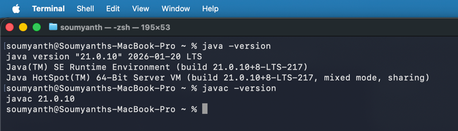
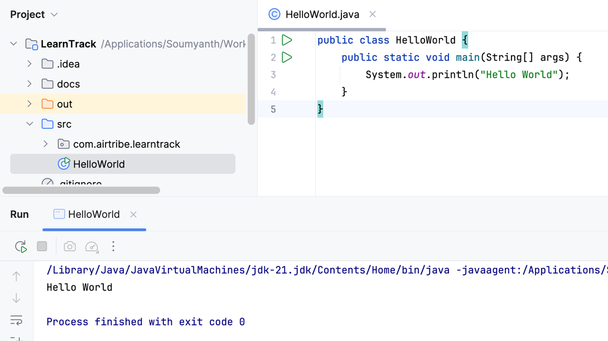

1) JDK version used :
    

2) HelloWorld.java
    
## Hello World Program

To verify that Java was installed and configured correctly, a simple **Hello World** program was created and executed.

The program contains the `main()` method, which is the entry point of every Java application. 
Inside the `main()` method, the `System.out.println()` statement is used to print the text **"Hello World"** to the console.

After compiling and running the program successfully, the following output was displayed:

Output : 
Hello World

This confirms that the Java Development Kit (JDK) is installed correctly and the Java environment is properly configured.

